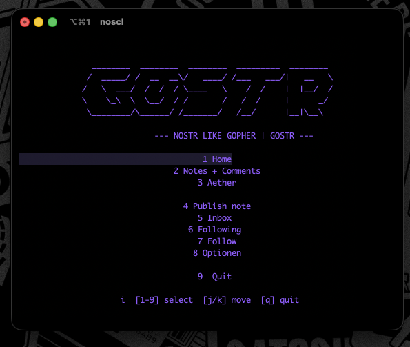
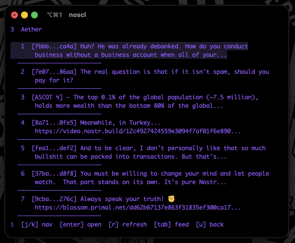
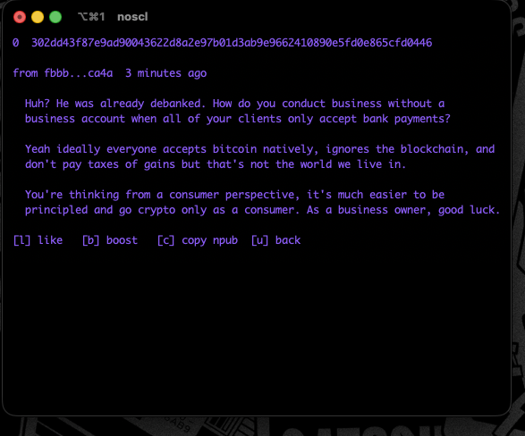

# Gostr

Nostr CLI with interactive TUI and Gopher-style output (Gostr). Based on [noscl](https://github.com/fiatjaf/noscl) by fiatjaf.

## Requirements

- Go 1.21 or later
- ~32 MB RAM (64 MB recommended)
- Terminal with ANSI support, 80x24 minimum for TUI
- Internet connection for Nostr relays (public relays at [nostr.watch/relays](https://nostr.watch/relays/find))

Runs on Linux, macOS, Windows, and FreeBSD. Tested on x86_64 and ARM (e.g. Raspberry Pi).

## Screenshots







## Installation

### Build from source

```bash
git clone https://github.com/k4lb1/Gostr.git
cd Gostr
make
```

The binary is built as `noscl` in the project directory. To install system-wide:

```bash
sudo mv noscl /usr/local/bin/
```

### Install via Go

```bash
go install github.com/k4lb1/Gostr@latest
```

The binary is placed in `$HOME/go/bin/` or `$GOPATH/bin` as `gostr`. Ensure that directory is in your PATH.

## Configuration

On first run, config and data are stored in `~/.config/nostr/`. Override with `-datadir`:

```bash
noscl -datadir ~/.nostr home
```

## Usage

```
noscl

Usage:
  noscl tui
  noscl home [--gopher] [--verbose] [--json] [--onlyreplies] [--noreplies] [--kinds=<kinds>...] [--since=<since>] [--until=<until>] [--limit=<limit>]
  noscl inbox [--gopher] [--verbose] [--json] [--onlyreplies] [--noreplies] [--since=<since>] [--until=<until>] [--limit=<limit>]
  noscl setprivate <key>
  noscl sign <event-json>
  noscl verify <event-json>
  noscl public
  noscl publish [--reference=<id>...] [--profile=<id>...] [--file=<file>] [<content>]
  noscl message [--reference=<id>...] <pubkey> <content>
  noscl metadata --name=<name> [--about=<about>] [--picture=<picture>] [--nip05=<nip05>] [--banner=<banner>] [--lud16=<lud16>] [--website=<website>]
  noscl profile [--verbose] [--json] <pubkey>
  noscl follow <pubkey> [--name=<name>]
  noscl unfollow <pubkey>
  noscl following
  noscl event view [--gopher] [--verbose] [--json] <id>
  noscl event delete <id>
  noscl share-contacts
  noscl key-gen
  noscl relay
  noscl relay add <url>
  noscl relay remove [--all]
  noscl relay remove <url>
  noscl relay recommend <url>

Specify <content> as '-' to read from stdin.
```

## Quick start

1. Add relays: `noscl relay add wss://relay.damus.io`
2. Generate a key: `noscl key-gen`
3. Set private key: `noscl setprivate <hex-or-nsec>`
4. Follow users: `noscl follow <pubkey> [--name=<name>]`
5. Run TUI or CLI: `noscl tui` or `noscl home`

## TUI (Interactive)

`noscl tui` launches an interactive interface with:

- Home (notes only) / Home (notes + replies) / Inbox
- Relay management
- Following list
- Set private key

Controls: `j`/`k` up/down, `enter` open, `r` refresh, `tab` switch feed, `u` back, `q` quit.

## Gopher output

Gostr can format Nostr data as RFC 1436 Gopher protocol output. Use `--gopher` with `home`, `inbox`, or `event view` to get menu-style lines instead of plain text. This lets you pipe Nostr feeds into Gopher servers or serve them over the classic pre-web protocol.

```bash
noscl home --gopher
noscl inbox --gopher
```

## Credits

- Original [noscl](https://github.com/fiatjaf/noscl) by fiatjaf
- Gostr fork and extensions by [k4lb1](https://github.com/k4lb1)

## Licenses

### Project

This project is released into the public domain. See [LICENSE](LICENSE).

Original noscl by fiatjaf is licensed under [PDDL](https://opendatacommons.org/licenses/pddl/) (Public Domain Dedication and License). Gostr is a derivative work.

### Third-party dependencies

Direct dependencies and their licenses:

| Package | License |
|---------|---------|
| [github.com/nbd-wtf/go-nostr](https://github.com/nbd-wtf/go-nostr) | BSD-3-Clause |
| [github.com/charmbracelet/bubbletea](https://github.com/charmbracelet/bubbletea) | MIT |
| [github.com/charmbracelet/bubbles](https://github.com/charmbracelet/bubbles) | MIT |
| [github.com/charmbracelet/lipgloss](https://github.com/charmbracelet/lipgloss) | MIT |
| [github.com/docopt/docopt-go](https://github.com/docopt/docopt-go) | MIT |
| [github.com/btcsuite/btcd](https://github.com/btcsuite/btcd) | ISC |
| [github.com/mitchellh/go-homedir](https://github.com/mitchellh/go-homedir) | MIT |
| [github.com/dustin/go-humanize](https://github.com/dustin/go-humanize) | MIT |
| [github.com/atotto/clipboard](https://github.com/atotto/clipboard) | BSD-3-Clause |
| [github.com/TheZoraiz/ascii-image-converter](https://github.com/TheZoraiz/ascii-image-converter) | Apache-2.0 |
| [gopkg.in/yaml.v2](https://gopkg.in/yaml.v2) | Apache-2.0 / MIT |

Full dependency tree and licenses can be verified with:

```bash
go list -m all
```

See [NOTICE](NOTICE) for attribution details.
